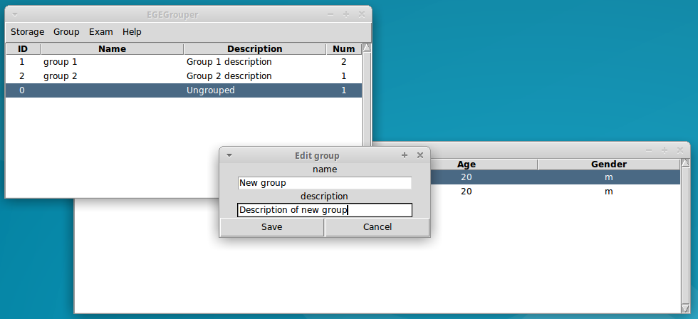
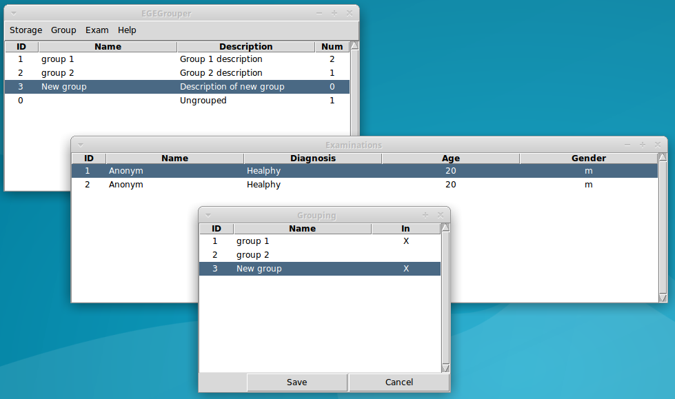

tkgrouper example
=================

Start tkgrouper on GNU/Linux::

  $ tkgrouper

On Windows press Start -> Run, type "tkgrouper" and press Enter.

Example of using tkgrouper on Xubuntu
^^^^^^^^^^^^^^^^^^^^^^^^^^^^^^^^^^^^^

1. Get example database from `here <https://bitbucket.org/aleneus/egegrouper/downloads/example.sme.sqlite>`_

2. Run tkgrouper.
      

3. Open database. **Menu -> Storage -> Open**.

.. image:: pic/tk-open-db-xub.png

4. Double click or press Enter on "Group 1" to show examinations of group 1.

5. Double click or press Enter on examination item or do **Menu -> Exam -> Plot** to plot signals of examination.

6. Add new group. **Menu -> Group -> Add**.

7. Add examination to group. Select examination and do **Menu -> Exam -> Grouping**.

8. Export examination to JSON folder. Select examination and do **Menu -> Exam -> Export JSON**.

